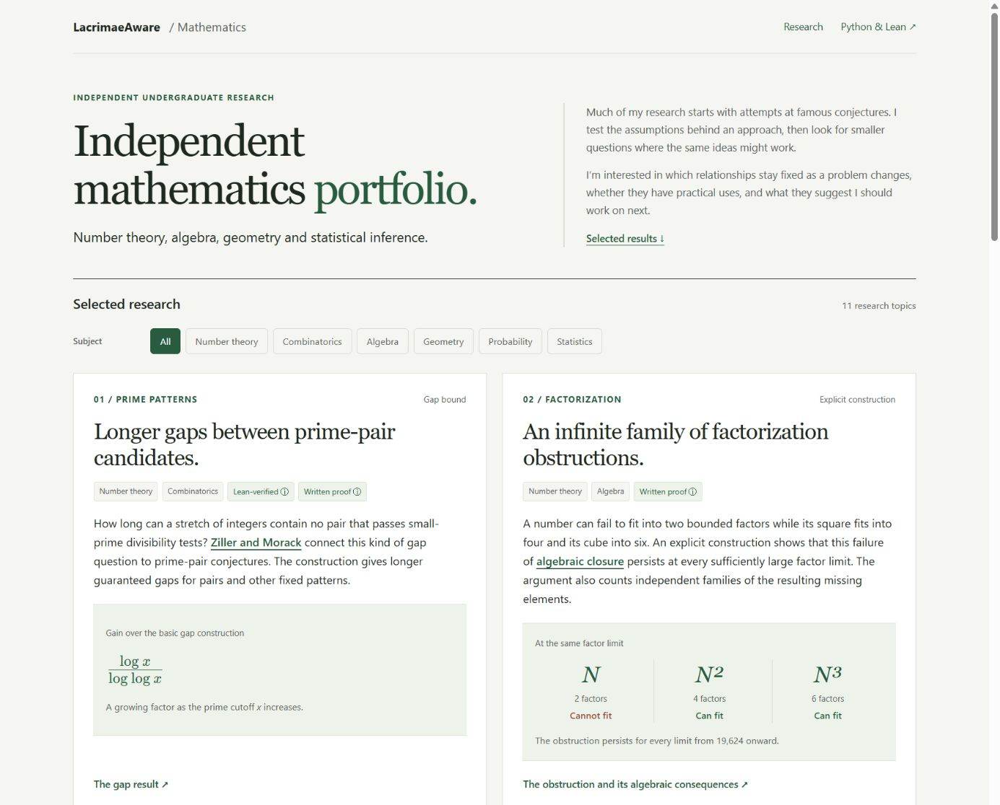

# Independent Mathematical Research

Number theory, algebra, geometry and statistical inference. A selection of results from independent undergraduate mathematical research.

**[Explore the visual portfolio →](https://lacrimaeaware.github.io/mathematical-research/)** · [Research index](RESEARCH.md) · [Python & Lean](https://lacrimaeaware.github.io/mathematical-research/notes/methods.html)

Much of my research starts with attempts at famous conjectures. I test the assumptions behind an approach, then look for smaller questions where the same ideas might work. I’m interested in which relationships stay fixed as a problem changes, whether they have practical uses, and what they suggest I should work on next.

## Three starting points

| Study | What it shows |
|---|---|
| [Hidden stages](https://lacrimaeaware.github.io/mathematical-research/notes/hidden-stages.html) · Statistical inference | How matched observations recover information about an intervention response that pooled completion times cannot determine. |
| [Factorization](https://lacrimaeaware.github.io/mathematical-research/notes/factor-packing.html) · Explicit construction | How one construction produces an infinite family of persistent factorization obstructions. |
| [Prime patterns](https://lacrimaeaware.github.io/mathematical-research/notes/prime-patterns.html) · Formal proof | A logarithmic gain in candidate gaps, with the scope of the Lean formalization and its two external theorem interfaces explained. |

**[Browse all eleven topics →](https://lacrimaeaware.github.io/mathematical-research/#research)** Each page introduces the question, connects it to existing work, and explains the result before the approach. Further topics include symmetric networks, recurring prime gaps and arithmetic tensors.

[Python experiments, Lean formalization and verification scope](https://lacrimaeaware.github.io/mathematical-research/notes/methods.html) · [Build the presentation locally](DEVELOPMENT.md)

---

**LacrimaeAware** · Developed with AI assistance in derivation, code and editing.

Unrefereed work. External priority is unestablished.
